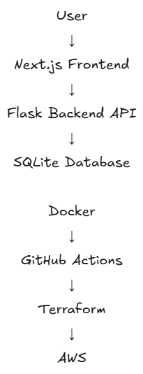
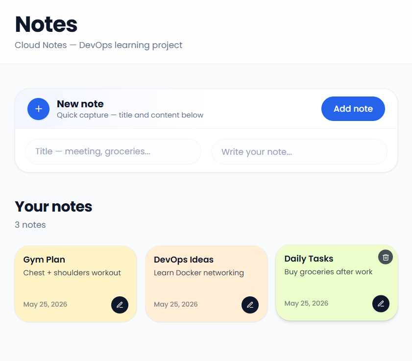
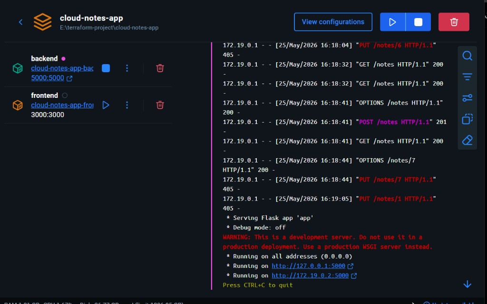
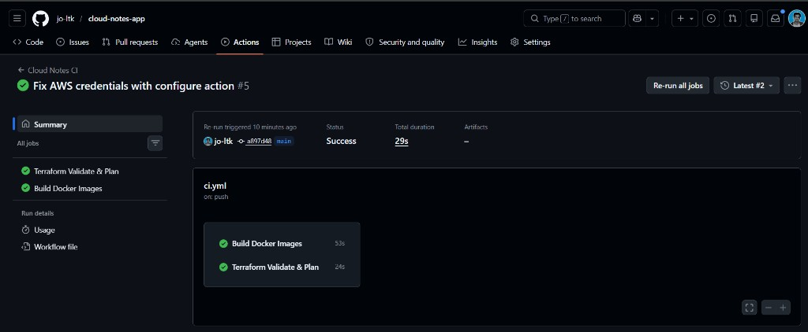

# Cloud Notes App

Short project intro

## Features

## Tech Stack

## Architecture

## Screenshots

### App UI

### Docker

### GitHub Actions

## Local Setup

## Docker Setup

## Terraform

## CI/CD Pipeline

## Future Improvements

## Terraform Plan

Terraform successfully validates and generates infrastructure plan for:

- VPC
- Public Subnet
- Internet Gateway
- Route Table
- Security Group
- EC2 Instance

Command used:

terraform plan -input=false "-var-file=environments/dev/terraform.tfvars"

### Kubernetes Deployment

