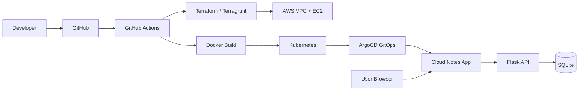

# Cloud Notes App — Beginner DevOps Mini Project

A simple full-stack notes app used to learn **Git, Docker, Terraform, AWS, Kubernetes, ArgoCD, Terragrunt, and GitHub Actions** end to end.

**Features:** Add note · View notes · Edit note · Delete note (full CRUD)

---

## Architecture



### End-to-end deployment flow

1. **Developer pushes code** to GitHub (`main` or `develop`).
2. **GitHub Actions** runs: Terraform `fmt` / `validate` / `plan`, and Docker image builds.
3. **Terraform (or Terragrunt)** provisions AWS: VPC, subnet, security group, EC2.
4. **Docker** packages the Next.js frontend and Flask backend.
5. **Kubernetes** runs Deployments (2 replicas) and NodePort Services.
6. **ArgoCD** watches the `kubernetes/` folder in Git and **auto-syncs** the cluster (GitOps).

---

## Folder structure

```
cloud-notes-app/
├── frontend/          # Next.js + Tailwind (App Router)
├── backend/           # Flask REST API + SQLite
├── docker/            # Dockerfiles
├── terraform/         # AWS infra + modules
├── kubernetes/        # K8s manifests + ArgoCD app
├── terragrunt/        # dev / staging / prod env configs
├── .github/workflows/ # CI/CD
├── docker-compose.yml
└── README.md
```

---

## Prerequisites

| Tool | Purpose |
|------|---------|
| Node.js 20+ | Frontend |
| Python 3.12+ | Backend |
| Docker Desktop | Containers |
| Terraform 1.5+ | AWS infra |
| Terragrunt (optional) | Multi-env DRY |
| kubectl | Kubernetes |
| AWS CLI | Cloud (optional for local-only) |

---

## Step 1 — Run locally (no Docker)

### Backend

```bash
cd backend
python -m venv venv
# Windows: venv\Scripts\activate
# Linux/Mac: source venv/bin/activate
pip install -r requirements.txt
python app.py
```

API runs at **http://localhost:5000**

| Route | Method | Description |
|-------|--------|-------------|
| `/notes` | GET | List all notes |
| `/notes` | POST | Create note `{ "title", "content" }` |
| `/notes/<id>` | PUT | Update note `{ "title", "content" }` |
| `/notes/<id>` | DELETE | Delete note |
| `/health` | GET | Health check |

### Frontend

```bash
cd frontend
cp .env.example .env.local
npm install
npm run dev
```

Open **http://localhost:3000**

Set `NEXT_PUBLIC_API_URL=http://localhost:5000` in `.env.local`.

---

## Step 2 — Frontend explained

| Path | Role |
|------|------|
| `app/page.tsx` | Main UI, hooks, fetch calls |
| `app/layout.tsx` | HTML shell + metadata |
| `components/NoteForm.tsx` | Add note form |
| `components/NoteList.tsx` | List + edit/delete buttons |
| `components/EditNoteModal.tsx` | Edit title/content + save |

**React hooks:** `useState` (notes, loading, errors), `useEffect` (load on mount), `useCallback` (stable fetch).

**API flow:** Browser → `fetch(NEXT_PUBLIC_API_URL/notes)` → Flask → SQLite → JSON response → React state update.

---

## Step 3 — Backend explained

| File | Role |
|------|------|
| `app.py` | Routes, CORS, DB init |
| `database.db` | Created automatically on first run |

**Flask structure:** One app file with routes (beginner-friendly). `init_db()` creates the `notes` table. Each request opens SQLite, runs SQL, returns JSON.

---

## Step 4 — Docker

### Concepts

- **Image** — Blueprint (Dockerfile).
- **Container** — Running instance of an image.
- **Network** — `docker-compose` links frontend → backend by service name.
- **Volume** — `backend-data` persists SQLite across restarts.

### Commands

```bash
# From cloud-notes-app/

# Build images
docker build -f docker/backend.Dockerfile -t cloud-notes-backend .
docker build -f docker/frontend.Dockerfile --build-arg NEXT_PUBLIC_API_URL=http://localhost:5000 -t cloud-notes-frontend .

# Run single containers
docker run -p 5000:5000 cloud-notes-backend
docker run -p 3000:3000 -e NEXT_PUBLIC_API_URL=http://host.docker.internal:5000 cloud-notes-frontend

# Run full stack (recommended)
docker compose up --build
```

- Frontend: **http://localhost:3000**
- Backend: **http://localhost:5000**

---

## Step 5–7 — Terraform (AWS)

### What gets created

- VPC, public subnet, Internet Gateway, route table
- Security group (ports 22, 80, 3000, 5000)
- EC2 instance

### Modules (why use them?)

| Module | Reuse benefit |
|--------|----------------|
| `modules/vpc` | Same network pattern for dev/staging/prod |
| `modules/security-group` | Consistent firewall rules |
| `modules/ec2` | Swap instance type per environment |

**Industry practice:** Root `main.tf` composes modules; environments only change **variables**.

### Commands

```bash
cd terraform
terraform init
terraform fmt -recursive
terraform validate
terraform plan
terraform apply

# Dev-specific variables
terraform plan -var-file=environments/dev/terraform.tfvars
terraform apply -var-file=environments/dev/terraform.tfvars
```

### Remote backend (S3 + DynamoDB)

**Terraform state** = JSON snapshot of real infrastructure. **Remote backend** stores it in S3 so teams share one truth. **DynamoDB locking** prevents two people running `apply` at once.

1. Create S3 bucket and DynamoDB table (see `terraform/backend.tf.example`).
2. Uncomment the `backend "s3"` block in `provider.tf`.
3. Run `terraform init -migrate-state`.

---

## Step 8 — GitHub Actions

Workflow: `.github/workflows/ci.yml`

| Job | Steps |
|-----|--------|
| `terraform` | checkout → setup-terraform → fmt → init → validate → plan |
| `docker` | checkout → build backend + frontend images |

**CI/CD flow:** Push → automated checks → (you add CD later: push images to ECR, `kubectl apply`, etc.).

Add GitHub secrets: `AWS_ACCESS_KEY_ID`, `AWS_SECRET_ACCESS_KEY` for real Terraform plans.

---

## Step 9 — Kubernetes

### Concepts

- **Pod** — One or more containers.
- **Deployment** — Desired replica count (here: **2**).
- **Service** — Stable network; **NodePort** exposes ports on each node.

### Commands

```bash
# Build/load images into cluster (e.g. minikube, kind)
docker build -f docker/backend.Dockerfile -t cloud-notes-backend:latest .
docker build -f docker/frontend.Dockerfile -t cloud-notes-frontend:latest .

kubectl apply -f kubernetes/deployment.yaml
kubectl apply -f kubernetes/service.yaml

kubectl get pods
kubectl get svc
kubectl get deployments
```

Access (NodePort defaults in manifests):

- Frontend: `http://<node-ip>:30300`
- Backend: `http://<node-ip>:30500`

---

## Step 10 — ArgoCD (GitOps)

File: `kubernetes/argocd-application.yaml`

1. Install ArgoCD in your cluster.
2. Update `repoURL` to your GitHub repo.
3. Apply: `kubectl apply -f kubernetes/argocd-application.yaml`

**GitOps:** Git is the source of truth. ArgoCD **auto-syncs** when `kubernetes/` changes — continuous deployment without manual `kubectl` for every change.

---

## Step 11 — Terragrunt

**Why Terragrunt?** DRY — one Terraform codebase, many environments with different `inputs` and **separate state files** per folder.

```bash
cd terragrunt/dev
terragrunt init
terragrunt plan
terragrunt apply

cd ../staging
terragrunt plan

cd ../prod
terragrunt plan
```

Set env vars for remote state:

```bash
export TF_STATE_BUCKET=your-unique-terraform-state-bucket
export TF_LOCK_TABLE=terraform-state-lock
export AWS_REGION=us-east-1
```

---

## Step 12 — Git & GitHub

```bash
cd cloud-notes-app
git init
git branch -M main
git checkout -b feature/notes-ui

git add .
git commit -m "Add Cloud Notes App initial structure"
git remote add origin https://github.com/YOUR_USERNAME/cloud-notes-app.git
git push -u origin main
```

### Pull Request workflow

1. Create branch `feature/my-change`
2. Push and open **Pull Request** on GitHub
3. CI runs (Terraform + Docker)
4. Review → **Merge** into `main`
5. ArgoCD / CD deploys from `main`

**Branching strategy (simple):** `main` = production-ready, `develop` = integration, `feature/*` = short-lived work.

---

## Step 13 — Linux commands cheat sheet

| Command | What it does |
|---------|----------------|
| `ls` | List files |
| `cd` | Change directory |
| `pwd` | Print current directory |
| `chmod +x script.sh` | Make file executable |
| `chown user:group file` | Change file owner |
| `grep "error" app.log` | Search text in files |
| `find . -name "*.py"` | Find files by name |
| `systemctl status docker` | Check service status (Linux) |
| `docker ps` | List running containers |
| `docker logs <id>` | View container logs |
| `kubectl get pods` | List Kubernetes pods |
| `kubectl describe pod <name>` | Pod details |
| `kubectl apply -f file.yaml` | Apply manifest |

---

## Quick reference — run entire project (local)

```bash
# Terminal 1
cd backend && pip install -r requirements.txt && python app.py

# Terminal 2
cd frontend && npm install && npm run dev

# Or one command with Docker
docker compose up --build
```

---

## Learning checklist (one day)

- [ ] Run backend + frontend locally
- [ ] Add, view, edit, delete notes in the UI (CRUD)
- [ ] `docker compose up --build`
- [ ] `terraform plan` (AWS credentials configured)
- [ ] Push to GitHub and see Actions green
- [ ] `kubectl apply` on a local cluster (minikube/kind)
- [ ] Read ArgoCD Application manifest

---

## Security notes (learning project)

- Security groups allow broad access for demos — **tighten CIDRs** in production.
- Do not commit `.env`, AWS keys, or `terraform.tfvars` with secrets.
- Replace placeholder AMI ID with a current Amazon Linux 2023 AMI for your region.

---

## License

MIT — use freely for learning.
